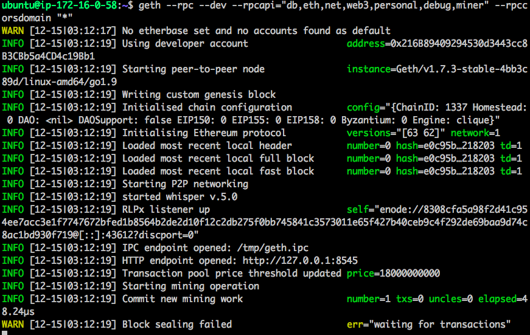
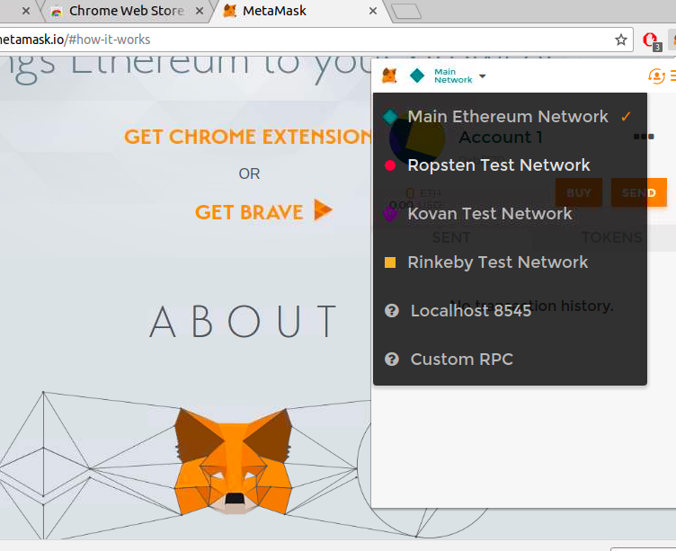
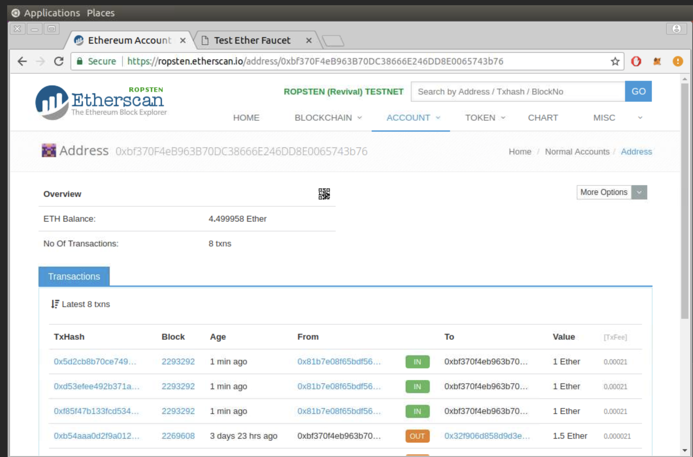
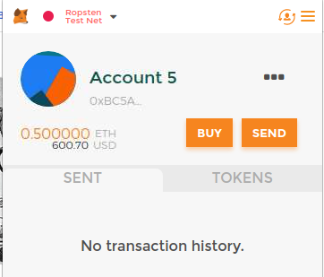
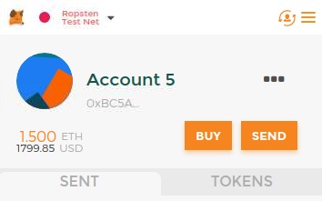

[<< back to main index](../README.md)

Lab 1.1: Ethereum Tools Lab
========================

In this lab we will practice Ethereum tools: geth, Metamask, and Infura.

Lab Goals:

* Get familiar with  Ethereum tools

### STEP 1: Login to the server
 
Each student is provided their individual server and credentials

(Instructor: use our ubuntu AMI, t2.large or t2.xlarge instances and Blockchain security group)
    
Labs are only verified for Ubuntu, 64 bit, v. 16+

Suggestion: create a notes text file on your Ubuntu Desktop, and put your lab credentials there. 
It will be convenient to have handy, that both in the VNC and on the SSH login.
 
### STEP 2: Install ethereum (geth)
 
    sudo apt-get install software-properties-common
    sudo add-apt-repository -y ppa:ethereum/ethereum
    sudo apt-get update
    sudo apt-get install ethereum
    
### STEP 3: Verify the installation

    geth --help
    
You should get an output like below

```console
NAME:
   geth - the go-ethereum command line interface

   Copyright 2013-2018 The go-ethereum Authors

USAGE:
   geth [options] command [command options] [arguments...]

VERSION:
   1.8.8-stable-2688dab4

COMMANDS:
   account           Manage accounts
   attach            Start an interactive JavaScript environment (connect to node)
   bug               opens a window to report a bug on the geth repo
   console           Start an interactive JavaScript environment
   copydb            Create a local chain from a target chaindata folder
   dump              Dump a specific block from storage
   dumpconfig        Show configuration values
   export            Export blockchain into file
   export-preimages  Export the preimage database into an RLP stream
   import            Import a blockchain file
   import-preimages  Import the preimage database from an RLP stream
   init              Bootstrap and initialize a new genesis block
   js                Execute the specified JavaScript files
   license           Display license information
   makecache         Generate ethash verification cache (for testing)
   makedag           Generate ethash mining DAG (for testing)
   monitor           Monitor and visualize node metrics
   removedb          Remove blockchain and state databases
   version           Print version numbers
   wallet            Manage Ethereum presale wallets
   help, h           Shows a list of commands or help for one command
```

### STEP 4: Start ethereum in the developer mode

    geth --rpc --dev --rpcapi="db,eth,net,web3,personal,debug,miner" --rpccorsdomain "*"
    
What the parameters mean

Here we use the following parameters:

--  dev

Developer mode: pre-configured private network

-- rpc  
Enable the HTTP-RPC server


--rpcapi="db,eth,net,web3,personal,debug,miner"

--rpccorsdomain "*"  Domains from which to accept cross origin requests. Sign '*' means any domains   are allowed.

You will see an output like this



##### Warnings are OK.

### STEP 5: Install node.js


On Ubuntu 16.04, you can execute the following: (if you did not do this already in lab 1.2

```bash
sudo apt-get update && sudo apt-get upgrade && sudo apt-get install nodejs npm curl
```

Now check the version of node.js

```bash
nodejs --version
```
If the version is less than v.8.11.1, then execute the the following:

```bash
curl -sL https://deb.nodesource.com/setup_8.x | sudo -E bash -
```

Then execute this:

```bash
curl -sL https://deb.nodesource.com/setup_8.x | sudo -E bash -
```

### STEP 6: Start node.js

    node
    
When later you want to stop node.js, type

    .exit
    
Like so


### STEP 7: Using `npm` install `web3`

    npm install web3

### STEP 8: Install `Metamask` Chrome plugin

(Here, you will need the Desktop UI provided by the trainer)

In Chrome, go to [this link](https://chrome.google.com/webstore/detail/metamask/nkbihfbeogaeaoehlefnkodbefgpgknn?hl=en
) or simply search for `Metamask`

Go through installation, then select Ropsten network. We will be only testing.



### STEP 9: Get some `ether`

- Click on BUY
- Request `ether` from Roptsten test network. (Give it time to digest).

### STEP 10: Using Metamask
 
Metamask has an intuitive user interface

- Create a second acount
- Practice sending `ether` from one account to the other

### STEP 11: Using Etherscan service balance

We are going to use the Etherscan service for this

- Open your browser at this URL

    https://ropsten.etherscan.io 
    
- Check your account balance for Account 1 that you have created in Metamask
- For that, in Metamask, copy the account address and add it to the URL in Etherscan
- It can look something like this



- Watch your balance, compare what you see in Etherscan to what you see in Metamask.
- Are the balances the same?
- What additional information can you see in Etherscan?

### STEP 12: Infura Registation 

- Perform Infura registration. 
- Once you register, you will get an email with links, but all you need is your token. Save it for future reference.

Email example


Check your account balance programmatically, using node.js

    node
    
This will open the `node` shell. Now enter the following code

    var Web3 = require('web3')
    var web3 = new Web3(new  Web3.providers.HttpProvider(
    "https://ropsten.infura.io/sWLle7AQrfjC9gmy4ZkS"));
    
Verify the balance on your account

    web3.eth.getBalance('0xAe2f9e4c9D1F928AE8996d45af7aeC0Ffabf0BEb')
    
### STEP 13: Manage your first account with `geth` in developer mode 

(This assumes that your geth dev network is running, as in STEP 4, perhaps in another terminal)

In the new terminal, enter

    geth attach rpc:http://localhost:8545 
    
Inside the `geth` shell, enter

    personal.newAccount()
    
When asked for a passphrase, for this lab we will use '1' six time

    111111                  
    
You will see your new account. The output will look like this

    > personal.newAccount()
    Passphrase:
    Repeat passphrase:
    "0x6a6d50c1e623e4d9b35f7ed300a77ad34534bcf4"
       
Use this account to check the balance

    eth.getBalance('0x6a6d50c1e623e4d9b35f7ed300a77ad34534bcf4');
    
Since this account has just been created, the balance should be 0.

Now start mining

    miner.start(1)
    
Give it a few seconds. You will see the activity in the geth network in another terminal.

Then check the account balance again

    eth.getBalance('0x6a6d50c1e623e4d9b35f7ed300a77ad34534bcf4');
    
You should see a non-zero number.            
    
### STEP 14: Operate another account    
    
Create a second account    

    personal.newAccount()
    
Let us use the same passphrase

    111111
    
You will get another account, for example,

    > personal.newAccount()
    Passphrase:
    Repeat passphrase:
    "0xb0aa4120973b35f9097c2db9a84609db53365ea4"
    
Check the accounts you now have

    eth.accounts
    
You will see a display of all accounts in your test networks, like this

    > eth.accounts
    ["0x1af257fb62f0bfff8de5d50117704442633b042e", 
    "0x6a6d50c1e623e4d9b35f7ed300a77ad34534bcf4", 
    "0xb0aa4120973b35f9097c2db9a84609db53365ea4"]
    >
    
Check the balance for the newly created account, like this

    > eth.getBalance("0x1af257fb62f0bfff8de5d50117704442633b042e")
    1.15792089237316195423570985008687907853269984665640564039457584007913129639927e+77
    
### STEP 15: Do transfers between accounts

    eth.sendTransaction(
    {from:'0x402d25a582a9a58c64039546e3eb0324d08da1b0', 
    to:'0xb0f77aa0ed6ef2dba6fc0332713b308e80253cc4', 
    value: web3.toWei(3, "ether")})
    
    Here:
    From *** - your first account
    To *** –  your second  account
    Value *** - amount of ether to transfer
                      

Check the balance on the second account, that one to which you transfered 3 ethers. 
There should be an additional 3 000 000 000 000 000 000 wei on the address, or  3 ether. 

# BONUS (OPTIONAL) STEPS

### STEP 16: Practice transfers of ether using Metamask, geth, and Infura.

* Feel free to experiment
* Or, do the steps below, which give you the detailed instructions, and then go back to this step and 
experiment some more.

### STEP 17: Account balance query

How do you get the amount of ether on the address 
`0x326946C0402000cc70fcB5823B0d3B9472cC371e` in Ropsten network, using geth.
This is a special account which we prepared for you lab.

(Try solving this yourself first)

**Solution:**

In a Terminal, run the commands:

    node 
    var Web3 = require('web3')
    var web3 = new Web3(new  Web3.providers.HttpProvider("https://ropsten.infura.io/Your_Access_Token"));
    web3.eth.getBalance('0x326946C0402000cc70fcB5823B0d3B9472cC371e')
    
**Answer:**   

1.994555733 Ether


### STEP 18: Account creation

How to create a new address in developer mode and then transfer 0.5 ether on it, using Metamask?

(Try solving this yourself first)

**Solution:**

* Create new address:

* Click Metamask icon. In the window click  menu in the form of a silhouette of a person in a circle. In the new menu select  “Create Account”;


* Click three black dots near a word Account1, and select a menu “Copy Address to clipboard”. Save the address.


* Select the first account in  Metamask and click the button Send:

* Type in  the field  Recipient Address the address you saved on previous step.
* Type 0.5 in the field Amount and then click the button  Submit.

* Wait for about half a minute to complete the  transaction.

* Check the balance of your new account in metamask. It should be 0.5 ether:


### STEP 19: Troubleshooting

Run `geth`  with the following parameters:

    geth --dev --rpcapi="db,eth,net,web3,personal,debug,miner" --rpccorsdomain "*"

Now, connect to the geth in separate terminal tab:

    geth attach rpc:http://localhost:8545

You will see an error message:

Fatal: Failed to start the JavaScript console

What is the reason for this error?

(Try solving this yourself first)

**Solution:**

Answer:
Every parameter after the command 'geth' is important (duh!).  This time, one parameter is missing:
`--rpc`

So HTTP-RPC server is disabled and you cannot start  console to control 'geth'.    

### STEP 20: Get some more Ether for the address you just created and check the balance.
 
(Hint) This should be done free of charge and not using transfers from your other addresses. 
Check the balance of the address with Metamask.

(Try solving this yourself first)

**Solution:**

In Metamask, Select Ropsten Test Network.

* Select the account you create above.
* Click the button BUY
* Now click the button ROPSTEN TEST FAUCET
* Wait a minute and you will see the Ropsten provided  you with additional 1 ether on your balance.
* The balance should be equal to you balance plus 1 Ether.

Bingo!


### STEP 21: Balance checking with Infura

(Try solving this yourself first)

**Solution:**

Connect to Infura as described above

Here is my solution, and you can do the same


### Congratulations! You are well familiar with `geth` tools

