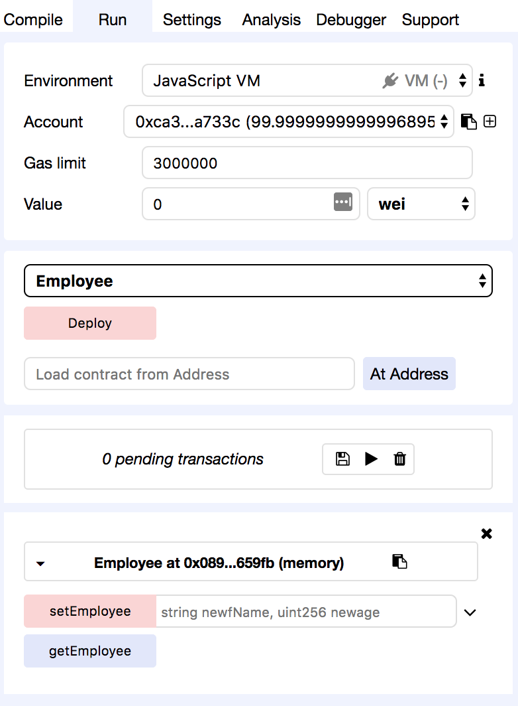

[<< back to main index](../README.md)

Lab 1.2: Getting Started with Remix Online
========================

## Step 1: Go to remix site

Go to [https://remix.ethereum.org/](https://remix.ethereum.org/)

Open up a new document. (the plus icon to the left). The document name should be "Employee.sol"

Your screen should look like this:


## Step 2: Enter a basic Contract 

Copy in the following code:

```solidity
pragma solidity ^0.4.18;
contract Employee {
}
```

* NOTE: The very first line defines the version of solidity you're going to use.
* NOTE: You will notice that underneath the Deploy button it shows a new section with the name of the contract and "at 0x..." (memory):

## Step 3: Compile

Press the "compile" tab to the right hand side, as shown.  


Press the "Start to Compile" button.  Notice that the compilation process generates no errors but does generate some warnings
from static code analysis. Ignore these warnings.

## Step 4: Run

Now, go to the "run" tab on the right hand side of the screen, as shown.


You will need to change the execution engine to "Javascript VM." This is because we are going to run as a test in our browser.

Notice that we have an account as shown, along with a gas limit.

Make sure the dropdown underneath selects "Employee" as shown, and then click on the deploy button.

You will see that the employee object shows up at the bottom of the screen.  Of course, now it does not yet do anything. 

Note: Notice there's a **contractAddress**; this is where the smart contract is located. In this example it's not live on the Ethereum Blockchain since were working within the JavaScript EVM.

Also notice **gas**. Every time a contract is deployed and modified, nodes on the Ethereum network must verify the contract. It's referred to as being redundantly parallel, as a way to reach consensus.

Gas is the name for the execution fee that senders of transactions (in our case, senders of a smart contract transaction) will pay for verification.

## Step 5: Update the Smart Contract with code

Update your smart contract with the following:

```solidity
pragma solidity ^0.4.18;

contract Employee {
  string fName = 'Maria';
  uint age = 30;
}
```

Hit **Deploy** to create the contract. At this point, if you look under details or
try to drop down the contract at the right column, you will see nothing.

Where are our variables?

Let's add **pubic** visibility to our variables. 

What is public visibility?  It means that the variable is accessible via messages.

**=> TODO: Add the public keyword modifier to the contract**

Notice that unlike other languages (Java/C/C++), the public keyword comes after and not before the type of the variable.

```solidity
pragma solidity ^0.4.18;

contract Employee {
  string ??? fName = 'Maria';
  uint ??? age = 30;
}
```

Click Deploy and there will be two buttons (pink and blue)  on the right side with the names of our variables and associated values.




 When you define public state variables, the EVM creates better functions for
 them. So, you can click on these buttons and it will return the value, as if it
 were a function.

## Step 6: Add Methods to our contract.

Add a constructor to your contract.

```solidity
pragma solidity ^0.4.18;

contract Employee {
    string public fName = 'Maria';
    uint public age = 44;

    constructor() public {
        fName = 'Maria';
        age = 34;
    }
}
```

If you hit **Deploy**, you will see the result is the same.

Let's transform the fName variable into a constant variable (so it can't change)

**=> TODO: replace 'public' with constant for fName**

```solidity
pragma solidity ^0.4.18;

contract Employee {
    string public fName = 'Maria';
    uint ??? age = 44;

    constructor() public {
        fName = 'Maria';
        age = 34;
    }
}
```

**=> Note: In your IDE: you'll notice a red "X" next to line 9.  If you hover over it, you will notice that it says**
"TypeError: Cannot assign to constant variable."

Remove line 9 and the error goes awaay.

## Step 7: Set some members, getters, and setters

Our smart contract at this point is very basic. Let's integrate a potential user
interaction where we can manually define an Employee's name and age.
 
**=> TODO: Paste the following:**

```solidity
pragma solidity ^0.4.18;

contract Employee {
    string fName = 'Maria';
    uint age = 44;

    function setEmployee(string _fName, uint _age) public {
        fName = _fName;
        age = _age;
    }
    
    function getEmployee() public constant returns (string, uint) {
        return (fName, age);
    }
}
```

As you can see, we deleted the constructor for now.

We now have a getter and setter function forthe contract.

## Step 8: More additions to the contract.

 Let's add a few things to the contract.

**=> Update the getter and setter function for the contract for a new class member called Title (i.e., Developer, Manager).**

**=> Add the constructor back into the class. Update the constructor to include the Employee's Title**

