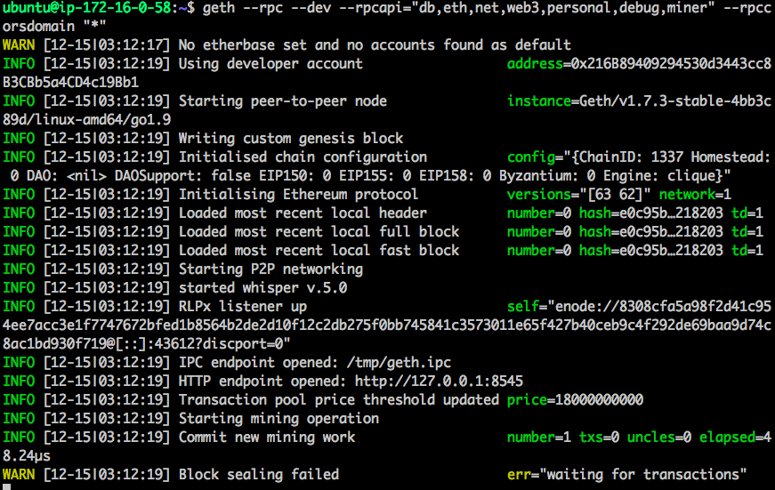
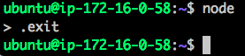
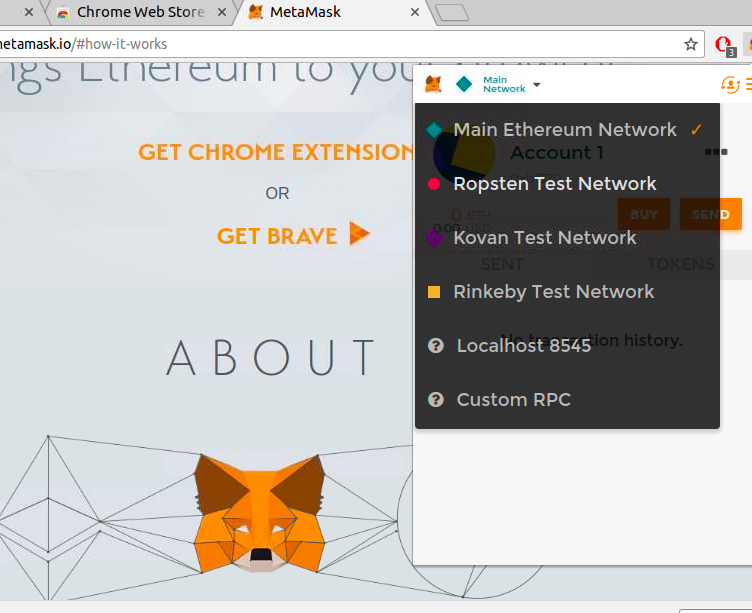
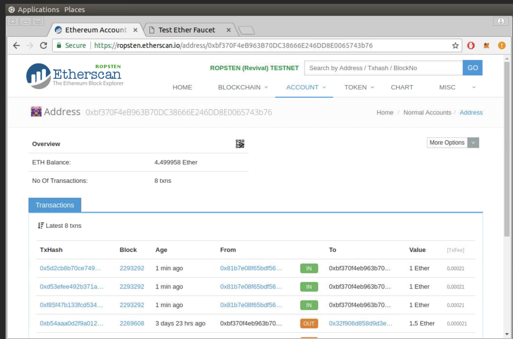
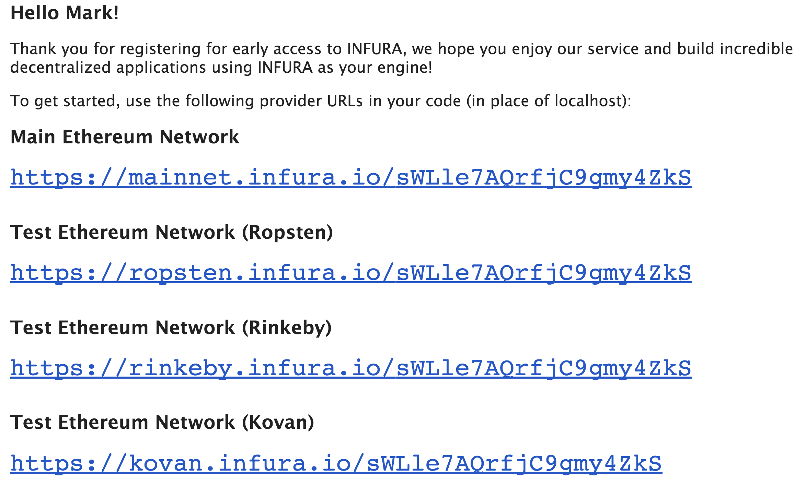

# Ethereum tools lab

In this lab we will practice Ethereum tools: geth, Metamask, and Infura.

Lab Goals:

* Get familiar with  Ethereum tools

### STEP 1: Login to the server
 
Each student is provided their individual server and credentials

(Instructor: use our ubuntu AMI, t2.large or t2.xlarge instances and Blockchain security group)
    
Labs are only verified for Ubuntu, 64 bit, v. 16+
 
### STEP 2: Install ethereum (geth)
 
    sudo apt-get install software-properties-common
    sudo add-apt-repository -y ppa:ethereum/ethereum
    sudo apt-get update
    sudo apt-get install ethereum
    
### STEP 3: Verify the installation

    geth --help
    
You should get an output like below

    
### STEP 4: Start ethereum in the developer mode

    geth --rpc --dev --rpcapi="db,eth,net,web3,personal,debug,miner" --rpccorsdomain "*"
    
What the parameters mean

Here we use the following parameters:

--  dev

Developer mode: pre-configured private network

-- rpc  
Enable the HTTP-RPC server

--rpcapi="db,eth,net,web3,personal,debug,miner"

--rpccorsdomain "*"  Domains from which to accept cross origin requests. Sign '*' means any domains   are allowed.

You will see an output like this

##### Warnings are OK.

### STEP 5: Install node.js

    sudo apt-get install nodejs

### STEP 6: Start node.js

    node
    
When later you want to stop node.js, type

    .exit
    
Like so

### STEP 7: Install node.js package manager

    sudo apt-get install npm

### STEP 8: Using `npm` install `web3`

    npm install web3

### STEP 9: Install `Metamask` Chrome plugin

(Here, you will need the Desktop UI provided by the trainer)

In Chrome, go to [this link](https://chrome.google.com/webstore/detail/metamask/nkbihfbeogaeaoehlefnkodbefgpgknn?hl=en
) or simply search for `Metamask`

Go through installation, then select Ropsten network. We will be only testing.

### STEP 10: Get some `ether`

- Click on BUY
- Request `ether` from Roptsten test network. (Give it time to digest).

### STEP 11: Using Metamask
 
Metamask has an intuitive user interface

- Create a second acount
- Practice sending `ether` from one account to the other

### STEP 12: Using Etherscan service balance

We are going to use the Etherscan service for this

- Open your browser at this URL

    https://ropsten.etherscan.io 
    
- Check your account balance for Account 1 that you have created in Metamask
- For that, in Metamask, copy the account address and add it to the URL in Etherscan
- It can look something like this

- Watch your balance, compare what you see in Etherscan to what you see in Metamask.
- Are the balances the same?
- What additional information can you see in Etherscan?

### STEP 13: Infura Registation 

- Perform Infura registration. (It may be useful in your work, so save the credentials.)

Once you register, you will get an email with all the needed tokens. Keep them as well.
(I am using KeePass for such things.)

Email example

Check your account balance programmatically, using node.js

    node
    
This will open the `node` shell. Now enter the following code

    var Web3 = require('web3')
    var web3 = new Web3(new  Web3.providers.HttpProvider(
    "https://ropsten.infura.io/sWLle7AQrfjC9gmy4ZkS"));
    
Verify the balance on your account

    web3.eth.getBalance('0xAe2f9e4c9D1F928AE8996d45af7aeC0Ffabf0BEb')
    
### STEP 14: Manage your first account with `geth` in developer mode 

(This assumes that your geth dev network is running, as in STEP 4, perhaps in another terminal)

In the new terminal, enter

    geth attach rpc:http://localhost:8545 
    
Inside the `geth` shell, enter

    personal.newAccount()
    
When asked for a passphrase, for this lab we will use '1' six time

    111111                  
    
You will see your new account. The output will look like this

    > personal.newAccount()
    Passphrase:
    Repeat passphrase:
    "0x6a6d50c1e623e4d9b35f7ed300a77ad34534bcf4"
       
Use this account to check the balance

    eth.getBalance('0x6a6d50c1e623e4d9b35f7ed300a77ad34534bcf4');
    
Since this account has just been created, the balance should be 0.

Now start mining

    miner.start(1)
    
Give it a few seconds. You will see the activity in the geth network in another terminal.

Then check the account balance again

    eth.getBalance('0x6a6d50c1e623e4d9b35f7ed300a77ad34534bcf4');
    
You should see a non-zero number.            
    
### STEP 15: Operate another account    
    
Create a second account    

    personal.newAccount()
    
Let us use the same passphrase

    111111
    
You will get another account, for example,

    > personal.newAccount()
    Passphrase:
    Repeat passphrase:
    "0xb0aa4120973b35f9097c2db9a84609db53365ea4"
    
Check the accounts you now have

    eth.accounts
    
You will see a display of all accounts in your test networks, like this

    > eth.accounts
    ["0x1af257fb62f0bfff8de5d50117704442633b042e", 
    "0x6a6d50c1e623e4d9b35f7ed300a77ad34534bcf4", 
    "0xb0aa4120973b35f9097c2db9a84609db53365ea4"]
    >
    
Check the balance for the newly created account, like this

    > eth.getBalance("0x1af257fb62f0bfff8de5d50117704442633b042e")
    1.15792089237316195423570985008687907853269984665640564039457584007913129639927e+77
    
### STEP 16: Do transfers between accounts

    eth.sendTransaction(
    {from:'0x402d25a582a9a58c64039546e3eb0324d08da1b0', 
    to:'0xb0f77aa0ed6ef2dba6fc0332713b308e80253cc4', 
    value: web3.toWei(3, "ether")})
    
    Here:
    From *** - your first account
    To *** –  your second  account
    Value *** - amount of ether to transfer
                      

Check the balance on the second account, that one to which you transfered 3 ethers. 
There should be an additional 3 000 000 000 000 000 000 wei on the address, or  3 ether. 

### STEP 17 - BONUS

Practice transfers of ether using Metamask, geth, and Infura. 

