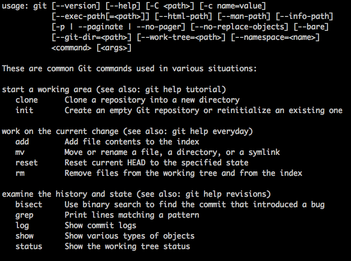
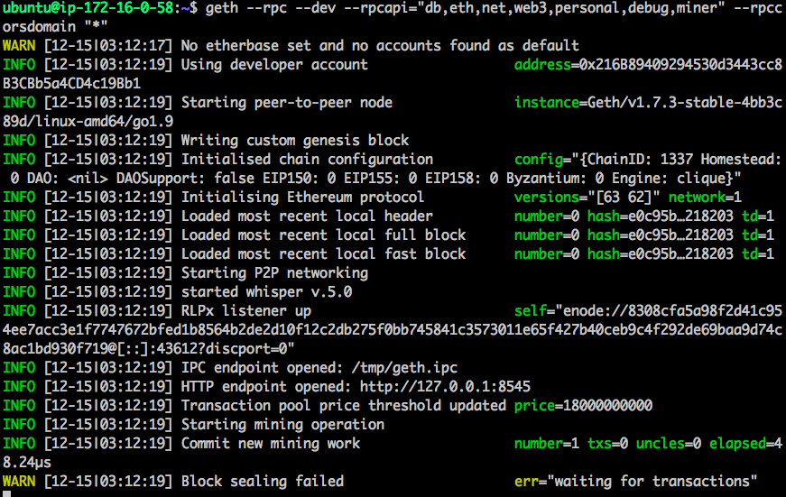
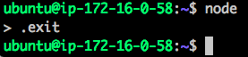
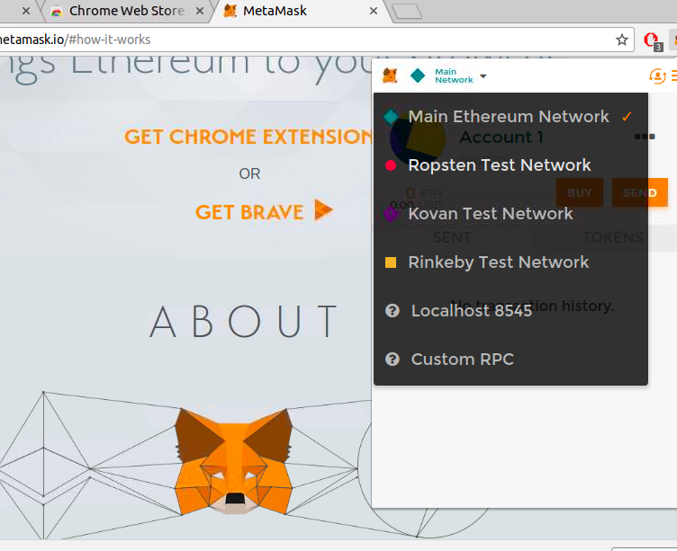

# Ethereum Lab 1

In this lab we will practice analytics queries.

Lab Goals:

* Get familiar with  Ethereum tools

### STEP 1: Login to the server
 
Each student is provided their individual server and credentials

(Instructor: use our ubuntu AMI, t2.large or t2.xlarge instances and Elasticsearch security group)
    
Labs are only verified for Ubuntu, 64 bit, v. 16+
 
### STEP 2: Install ethereum (geth)
 
    sudo apt-get install software-properties-common
    sudo add-apt-repository -y ppa:ethereum/ethereum
    sudo apt-get update
    sudo apt-get install ethereum
    
### STEP 3: Verify the installation

    geth --help
    
You should get an output like below

    
### STEP 4: Start ethereum in the developer mode

    geth --rpc --dev --rpcapi="db,eth,net,web3,personal,debug,miner" --rpccorsdomain "*"
    
What the parameters mean

Here we use the following parameters:

--  dev

Developer mode: pre-configured private network

-- rpc  
Enable the HTTP-RPC server

--rpcapi="db,eth,net,web3,personal,debug,miner"

--rpccorsdomain "*"  Domains from which to accept cross origin requests. Sign '*' means any domains   are allowed.

You will see an output like this

##### Warnings are OK.

### STEP 5: Install node.js

    sudo apt-get install nodejs

### STEP 6: Start node.js

    node
    
When later you want to stop node.js, type

    .exit
    
Like so

### STEP 7: Install node.js package manager

    sudo apt-get install npm

### STEP 8: Using `npm` install `web3`

    npm install web3

### STEP 9: Install `Metamask` Chrome plugin

(Here, you will need the Desktop UI provided by the trainer)

In Chrome, go to [this link](https://chrome.google.com/webstore/detail/metamask/nkbihfbeogaeaoehlefnkodbefgpgknn?hl=en
) or simply search for `Metamask`

Go through installation, then select Ropsten network. We will be only testing.

### STEP 10: Get some `ether`

- Click on BUY
- Request `ether` from Roptsten test network. (Give it time to digest).

### STEP 11: Using Metamask
 
Metamask has an intuitive user interface

- Create a second acount
- Practice sending `ether` from one account to the other

### STEP 12: Using Etherscan service

