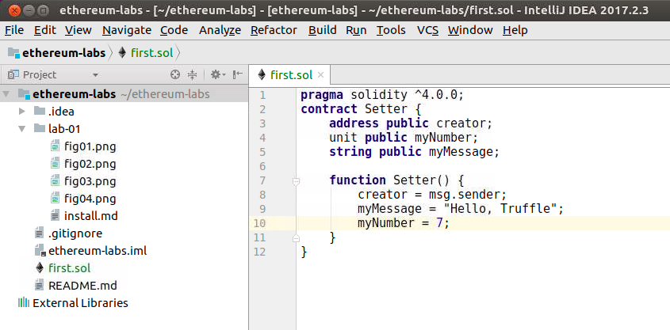

# Ethereum Lab 2

In this lab we will start on Solidity

Lab Goals:

* Get familiar with  Solidity tools

Life is good with IntelliJ

### STEP 1: Login to the server
 
Each student is provided their individual server and credentials

(Instructor: use our ubuntu AMI, t2.large or t2.xlarge instances and Elasticsearch security group)
    
Labs are only verified for Ubuntu, 64 bit, v. 16+
 
